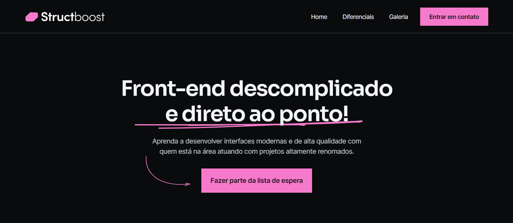

# Projeto Prático - Structboost

## Sobre o Projeto 🚀

Esse projeto foi desenvolvido como parte do curso Codeboost, ministrado pelo professor William Moreira. Esse é o primeiro projeto prático do curso, que consiste em desenvolver uma landing page utilizando as tecnologias aprendidas nos primeiros módulos.

Nesse projeto, aprendi mais sobre como estruturar o projeto antes de começar a codificar e como utilizar de componentes para facilitar o processo de desenvolvimento e, assim, otimizar o tempo. O layout foi disponibilizado no curso e é de autoria do mesmo.

## Tecnologias

Nesse projeto foram utilizados as seguintes tecnologias:

 

 
## Deploy

O deploy do projeto pode ser visualizado através do link: <a href="https://projectstructboost.vercel.app/">Structboost</a>

## Contato

 
   
     

